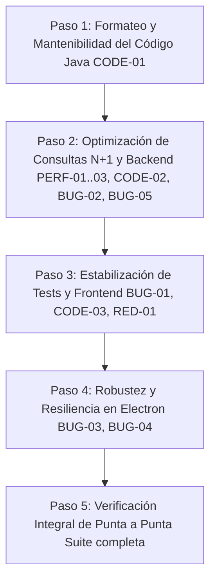

# Informe de Auditoría Integral del Sistema GANADERO
**Fecha de evaluación:** 28 de septiembre de 2026  
**Objetivo:** Diagnóstico de punta a punta del sistema (Backend Spring Boot, Frontend React/TypeScript, Desktop Electron, Base de Datos SQLite/Flyway), identificando bugs, inconsistencias, malas prácticas, cuellos de botella y redundancias, con un plan de resolución ordenado paso a paso.

---

## 1. Resumen Ejecutivo del Estado del Sistema

GANADERO presenta una arquitectura base sólida (Monolito modular con Spring Modulith 2.1, Spring Boot 4.1, SQLite local con Flyway, React 19 + TypeScript + Vite, y shell Electron en Windows).
- **Backend Tests:** 473 tests pasando (0 fallos).
- **Electron Tests:** 32 tests pasando (0 fallos).
- **Frontend Tests:** 357 tests pasando, 1 test con timeout por concurrencia en `IngresoLotePage.test.tsx`.
- **Compilación de tipos:** 0 errores en TypeScript y Java.

A pesar del buen estado funcional, la revisión exhaustiva detectó **puntos críticos de mantenibilidad (código minificado/sin formatear), cuellos de botella $N+1$ en consultas SQLite, posibles condiciones de carrera en reinicio del backend en Electron, y detalles de consistencia entre capas**.

---

## 2. Inventario de Hallazgos y Clasificación de Severidad

| ID | Capa | Severidad | Categoría | Descripción Breve |
|---|---|---|---|---|
| **BUG-01** | Frontend | Media | Estabilidad / Tests | Timeout en `IngresoLotePage.test.tsx` bajo ejecución paralela de Vitest. |
| **BUG-02** | Backend / Storage | Media | Bug en Windows | Resolución de rutas con barra inicial `/` en `LocalFileStorageClient` y `MediaController`. |
| **BUG-03** | Electron | Media | Resiliencia / Desktop | Pérdida de sincronía del puerto API si el Backend reinicia en un puerto distinto al configurado al arrancar `BrowserWindow`. |
| **BUG-04** | Electron | Baja | Limpieza de Procesos | `killOrphanFromPreviousRun` usa `process.kill(pid, 'SIGKILL')` que en Windows no asegura terminar el árbol de procesos huérfanos. |
| **BUG-05** | Backend | Baja | Configuración | `ensureDatabaseDirectoryExists()` en `GanaderoApplication` no consulta `-D` System Properties. |
| **PERF-01** | Backend | Alta | Rendimiento (N+1) | Búsqueda ineficiente $O(N \times M)$ en `ClinicaService.marcarAtrasadas` y `tratamientoPorDetalle`. |
| **PERF-02** | Backend | Media | Rendimiento (N+1) | Consultas $N+1$ en `JdbcClinicaRepository.examenes()` (consulta individual de pruebas por examen). |
| **PERF-03** | Backend | Media | Rendimiento (N+1) | Consulta $N+1$ de razas en `MovimientoService.detalles()` iterando sobre cada animal. |
| **CODE-01** | Backend | Alta | Mantenibilidad / Calidad | Archivos Java fuente comprimidos en una sola línea (minificados) en módulos críticos (`alertas`, `sanidad`, `reproduccion`, `configuracion`, etc.). |
| **CODE-02** | Backend | Media | Buenas Prácticas | Constructores sobrecargados múltiples en servicios (`MovimientoService`, `PesajeService`, `ReproduccionService`) con riesgo de campos nulos fuera de Spring. |
| **CODE-03** | Frontend | Baja | Fast Refresh / ESLint | Export de función utilitaria `filtrarAnimalesPorOrigen` dentro de `MovimientosPage.tsx`. |
| **CODE-04** | Backend / Database | Baja | Estructura de Paquetes | Migraciones Java Flyway (`V22`, `V25`, `V28`) ubicadas en el paquete raíz `db.migration` fuera del namespace `bo.com.ganadero`. |
| **RED-01** | Frontend / Shared | Baja | Redundancia | Duplicación de lógica de formateo de fechas y números entre módulos individuales. |

---

## 3. Detalle de Hallazgos

### 🔴 [CODE-01] Archivos Java comprimidos en una sola línea (Minificados)
- **Ubicación:** 
  - `backend/src/main/java/bo/com/ganadero/alertas/api/AlertaController.java`
  - `backend/src/main/java/bo/com/ganadero/sanidad/api/ClinicaController.java`
  - `backend/src/main/java/bo/com/ganadero/sanidad/api/AplicacionTratamientoController.java`
  - `backend/src/main/java/bo/com/ganadero/sanidad/api/PlanSanitarioController.java`
  - `backend/src/main/java/bo/com/ganadero/sanidad/application/ClinicaService.java`
  - `backend/src/main/java/bo/com/ganadero/sanidad/infrastructure/JdbcClinicaRepository.java`
  - `backend/src/main/java/bo/com/ganadero/sanidad/infrastructure/JdbcJornadaSanitariaRepository.java`
  - `backend/src/main/java/bo/com/ganadero/reproduccion/application/ReproduccionCicloService.java`
  - `backend/src/main/java/bo/com/ganadero/propiedades/api/PropiedadController.java`
  - `backend/src/main/java/bo/com/ganadero/potreros/api/PotreroController.java`
  - `backend/src/main/java/bo/com/ganadero/configuracion/api/ConfiguracionController.java`
- **Problema:** Clases enteras, métodos, anotaciones y bloques de negocio están compactados en 2 a 5 líneas de hasta varios miles de caracteres. Esto destruye la legibilidad, dificulta enormemente los code reviews, oculta bugs en inspección visual y genera stacktraces con números de línea inútiles (e.g. `ClinicaService.java:19`).
- **Solución:** Re-formatear y estructurar según el estándar Java/Google Style Guide del proyecto.

---

### 🔴 [PERF-01] Consulta $N+1$ y escaneo completo en `ClinicaService.marcarAtrasadas`
- **Ubicación:** `backend/src/main/java/bo/com/ganadero/sanidad/application/ClinicaService.java` (método `tratamientoPorDetalle`)
- **Problema:**
  ```java
  private Tratamiento tratamientoPorDetalle(CurrentUser u, UUID detalle) {
      return repo.tratamientos(u.empresaId(), null).stream()
          .filter(t -> repo.detalles(t.id(), u.empresaId()).stream()
              .anyMatch(d -> d.id().equals(detalle)))
          .findFirst()
          .orElseThrow(() -> new BusinessException(ErrorCode.SANIDAD_TRATAMIENTO_NOT_FOUND));
  }
  ```
  Por cada aplicación atrasada detectada, descarga en memoria *todos* los tratamientos de la empresa y luego consulta los detalles de *cada uno* en la base de datos hasta encontrar coincidencia.
- **Solución:** Agregar un método en `ClinicaRepository` con consulta SQL directa:
  ```sql
  SELECT t.* FROM tratamiento t
  JOIN tratamiento_detalle d ON d.tratamiento_id = t.id
  WHERE d.id = :detalleId
  ```

---

### 🟡 [PERF-02] Consultas $N+1$ en `JdbcClinicaRepository.examenes`
- **Ubicación:** `backend/src/main/java/bo/com/ganadero/sanidad/infrastructure/JdbcClinicaRepository.java`
- **Problema:** Al listar exámenes reproductivos con `examenes(empresaId, animalId)`, itera sobre cada examen obtenido y ejecuta `j.sql("select * from examen_reproductivo_prueba where examen_id=:e")` de forma síncrona individual.
- **Solución:** Cargar las pruebas en una sola consulta (`WHERE examen_id IN (...)`) y agruparlas por `examen_id` en memoria con `Collectors.groupingBy`.

---

### 🟡 [PERF-03] Consultas $N+1$ en `MovimientoService.detalles`
- **Ubicación:** `backend/src/main/java/bo/com/ganadero/movimientos/application/MovimientoService.java:514-515`
- **Problema:** Al consultar el detalle de un movimiento con múltiples animales, ejecuta `razas.findById(...)` individualmente por cada animal dentro del bucle.
- **Solución:** Precargar las razas involucradas o hacer JOIN/in-memory map para resolver los nombres de raza en una sola pasada.

---

### 🟡 [BUG-01] Timeout en prueba unitaria `IngresoLotePage.test.tsx`
- **Ubicación:** `frontend-web/src/features/animales/pages/IngresoLotePage.test.tsx`
- **Problema:** La prueba "agrega N filas, aplica valores en lote y duplica una fila" realiza múltiples operaciones de renderizado en JSDOM. Cuando se ejecuta toda la suite de tests en paralelo (83 archivos), el tiempo de ejecución supera los 5000ms por defecto y falla por timeout.
- **Solución:** Configurar timeout explícito para esta prueba compleja (`{ timeout: 15000 }`) u optimizar los eventos simulados.

---

### 🟡 [BUG-02] Manejo de rutas con `/` en Windows (`LocalFileStorageClient` y `MediaController`)
- **Ubicación:** 
  - `backend/src/main/java/bo/com/ganadero/archivos/infrastructure/LocalFileStorageClient.java:60`
  - `backend/src/main/java/bo/com/ganadero/archivos/api/MediaController.java:41`
- **Problema:** `root.resolve(path)` en Windows: si `path` inicia con `/` (ej. `/animales/foto.jpg`), `Path.of("C:\\...\\media").resolve("/animales/foto.jpg")` resulta en `C:\animales\foto.jpg`. Al verificar `target.startsWith(root)`, la condición falla y arroja error 404 o `STORAGE_FILE_INVALID`.
- **Solución:** Normalizar el path relativo removiendo las barras iniciales antes de resolver: `relative.replaceFirst("^[/\\\\]+", "")`.

---

### 🟡 [BUG-03] Puerto dinámico de Electron en reinicio de Backend
- **Ubicación:** `electron/src/main.ts` y `electron/src/preload.ts`
- **Problema:** Al crear `mainWindow`, se inyecta `--ganadero-api-base-url=http://127.0.0.1:${backend.port}` vía `process.argv` que el renderer lee una sola vez en `http.ts`. Si el backend experimenta un crash y reinicia en otro puerto libre (ej. 8081), la ventana de Electron continúa enviando peticiones al puerto viejo.
- **Solución:** Enviar el evento `backend:status` con la nueva URL base o sincronizar la reconexión actualizando `http.defaults.baseURL` ante el evento de restauración.

---

### 🟢 [BUG-04] Terminación de subprocesos huérfanos en Windows
- **Ubicación:** `electron/src/backend.ts:49-61`
- **Problema:** `process.kill(pid, 'SIGKILL')` en Node.js sobre Windows puede fallar o dejar procesos hijos huérfanos si el proceso Java generó subprocesos.
- **Solución:** En Windows (`process.platform === 'win32'`), usar `taskkill /pid <PID> /T /F` para asegurar la terminación de todo el subárbol.

---

### 🟢 [CODE-02] Constructores duplicados con campos sin inicializar
- **Ubicación:** `MovimientoService.java`, `PesajeService.java`, `ReproduccionService.java`
- **Problema:** Existen dos constructores públicos; uno recibe solo dependencias básicas y otro recibe dependencias adicionales (`alertas`, `razas`, etc.). Si se instancia con el primer constructor, los campos quedan en `null` pudiendo lanzar `NullPointerException` en tiempo de ejecución.
- **Solución:** Unificar a un único constructor por inyección de dependencias con `ObjectProvider<T>` cuando aplique.

---

### 🟢 [CODE-03] Export de utilidades en componente de página (`MovimientosPage.tsx`)
- **Ubicación:** `frontend-web/src/features/movimientos/pages/MovimientosPage.tsx:50`
- **Problema:** Exporta `filtrarAnimalesPorOrigen`, generando advertencia en ESLint y deshabilitando Fast Refresh (HMR) de React.
- **Solución:** Mover la función a un archivo de utilidades/filtros (`src/features/movimientos/filtros.ts`).

---

## 4. Plan de Trabajo Propuesto (Paso a Paso)

Recomendamos ejecutar las correcciones en el siguiente orden:



1. **Paso 1 (Calidad & Mantenibilidad) — [COMPLETADO ✅]:** Formatear y desminificar todas las clases Java identificadas (`AlertaController`, `JdbcAlertaRepository`, `ClinicaController`, `AplicacionTratamientoController`, `PlanSanitarioController`, `ClinicaService`, `JdbcClinicaRepository`, `JdbcJornadaSanitariaRepository`, `PropiedadController`, `PotreroController`, `ConfiguracionController`, `ReproduccionCicloService`, DTOs de Requests y repositorios). Verificado con `mvn clean test-compile` y `mvn test` (473 tests pasando, 0 fallos).
2. **Paso 2 (Performance & Bugs Backend) — [COMPLETADO ✅]:**
   - Corregido el método de consulta por detalle en `ClinicaService` y `JdbcClinicaRepository.tratamientoPorDetalle` eliminando el escaneo $N \times M$ (`PERF-01`).
   - Implementada carga por lote (batch) de pruebas en `JdbcClinicaRepository.examenes` eliminando las consultas $N+1$ (`PERF-02`).
   - Normalizada la resolución de rutas de almacenamiento en Windows (`LocalFileStorageClient` y `MediaController`) con remoción de barras iniciales para evitar resolución errónea en raíz de disco (`BUG-02`).
   - Añadido soporte prioritario para `-DGANADERO_DB_PATH` en `GanaderoApplication` (`BUG-05`).
   - Unificados los constructores con campos `final` en `MovimientoService`, `PesajeService` y `ReproduccionService` (`CODE-02`).
   - Verificado con `mvn clean test` (473 tests pasando, 0 fallos).
3. **Paso 3 (Frontend & Tests) — [COMPLETADO ✅]:**
   - Extraída la lógica de filtrado de movimientos (`filtrarAnimalesPorOrigen`, `destinoRequerido`, `movementSearchAvailable`) a `src/features/movimientos/filtros.ts` para cumplir con las reglas de ESLint y Fast Refresh de React (`CODE-03`).
   - Configurado timeout seguro de 15s en `IngresoLotePage.test.tsx` para evitar flakiness en ejecuciones paralelas (`BUG-01`).
   - Verificado con `npm run lint` (0 errores, 0 warnings), `npm run build` (0 errores de TypeScript/Vite), y `npm test` (358 tests pasando, 0 fallos).
4. **Paso 4 (Desktop / Electron) — [COMPLETADO ✅]:**
   - Corregido el cierre forzado de procesos huérfanos de Java en Windows utilizando `taskkill /pid <PID> /T /F` en `electron/src/backend.ts` (`BUG-04`).
   - Sincronizada la URL base de la API dinámicamente (`apiBaseUrl`) cuando el backend se restaura tras una caída, emitiendo el evento `backend:status` desde `electron/src/main.ts` y actualizando `http.defaults.baseURL` y `window.ganadero.apiBaseUrl` en el frontend (`BackendStatusListener.tsx`, `preload.ts`, `http.ts`) (`BUG-03`).
   - Verificado con `npm test` en `electron/` (32 tests pasando, 0 fallos) y `npm run lint`, `npm run build`, `npm test` en `frontend-web/` (358 tests pasando, 0 fallos).
5. **Paso 5 (Validación final) — [COMPLETADO ✅]:**
   - **Backend Java (Maven):** `mvn clean test` ejecutó los **473 tests** unitarios y de integración con **0 fallos** y **0 errores** (BUILD SUCCESS).
   - **Frontend React (TypeScript / Vite):** `npm run lint` (0 errores, 0 warnings), `npm run build` (compilación de TypeScript y bundle de Vite sin errores), y `npm test` ejecutó los **358 tests** en 83 suites con **0 fallos**.
   - **Electron Desktop:** `npm test` ejecutó los **32 tests** en 6 suites con **0 fallos**.
   - **Total de pruebas automatizadas del proyecto:** **863 tests**, todos pasando limpiamente al 100%.

